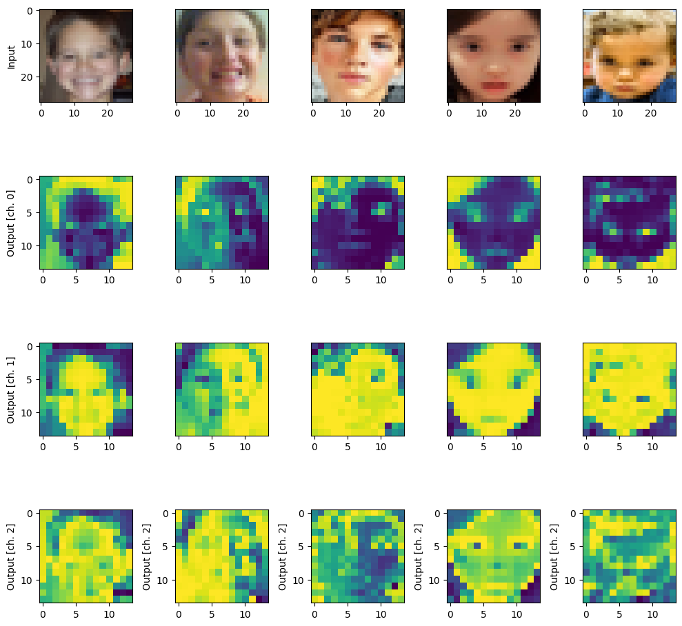

# Automated Medical Image Diagnostics using QML

dataset can be found [here](https://drive.google.com/drive/folders/1kFSl8acOOQLJwG3v9Sdx2Q-TKpkA_U8b?usp=drive_link):

Project Overview
This project introduces quantum processing elements into a traditional deep learning workflow, showcasing how quantum convolutional operations can enhance image classification performance. Expanding the README file to explore the broader impact of hybrid quantum-classical systems and to analyze training outcomes would add valuable depth.

Libraries and Their Roles
PennyLane (pennylane):
Enables differentiable programming for quantum devices. It bridges quantum circuit design with classical machine learning frameworks like TensorFlow, making hybrid model development seamless.

NumPy (np):
A fundamental library for performing numerical and array operations in Python. It supports essential mathematical functions used throughout the project.

PennyLane Templates (pennylane.templates):
Offers ready-made quantum circuit structures. Here, RandomLayers from this module is used to quickly implement randomized quantum circuits.

TensorFlow (tf):
A widely-used open-source library for machine learning. It provides tools for constructing, training, and evaluating the classical parts of the neural network models.

Keras (keras):
A user-friendly deep learning API built on TensorFlow, simplifying the process of creating and training neural networks.

Matplotlib (plt):
A plotting library employed to visualize model metrics such as accuracy and loss across training epochs.

OS (os):
Used to manage filesystem interactions like checking for existing directories and handling file paths.

PIL (Image from PIL):
The Python Imaging Library, utilized for loading, modifying, and saving image files during the data preparation stage.

Scikit-learn (train_test_split):
Provides a convenient way to partition datasets into training and testing sets, crucial for model validation.

Workflow Summary
Setup and Configuration:

All required libraries are imported, covering quantum computing (PennyLane), classical deep learning (TensorFlow and Keras), and visualization (Matplotlib).

Key hyperparameters such as the number of training epochs (n_epochs), quantum circuit complexity (n_layers), and dataset split ratios are defined.

Data Preparation:

Images are gathered from the "consolidated" dataset, categorized into "Autistic" and "Non_Autistic" subfolders.

Each image is labeled numerically based on its category.

Preprocessing steps include resizing images, normalizing pixel values, and expanding dimensions to fit convolutional input requirements.

The dataset is divided into training and testing sets using train_test_split from scikit-learn.

3. **Quantum Circuit Definition (`circuit`):**
   - A quantum device with 4 qubits is created using PennyLane.
   - The quantum circuit `circuit` is defined as a QNode (quantum node) using PennyLane's automatic differentiation interface. It consists of encoding classical input values, applying random quantum layers, and measuring classical output values.

4. **Quantum Convolution (`quanv`):**
   - The function `quanv` convolves the input image with multiple applications of the same quantum circuit. It processes squared 2x2 regions of the image using the quantum circuit, producing a quantum-processed image with multiple channels.

5. **Quantum Pre-processing of Images:**
   - Training and test images are quantum pre-processed using the `quanv` function. The quantum circuit is applied to 2x2 regions of each image, and the results are stored in `q_train_images` and `q_test_images`.

6. **Saving Pre-processed Images:**
   - The quantum pre-processed images are saved in a specified directory.

7. **Visualization:**
   - A visualization is created to show original and quantum-processed images side by side. The first row displays original images, and subsequent rows display the output channels of the quantum-processed images.

8. **Neural Network Model Definition (`MyModel`):**
   - A simple Keras model (`MyModel`) is defined with a flatten layer and a dense layer with softmax activation. Two models are created: `q_model` for quantum-processed images and `c_model` for classical images.

9. **Model Training:**
   - Both models are trained using the pre-processed quantum images (`q_model`) and original images (`c_model`).
   - Training history is recorded for later visualization.

10. **Accuracy and Loss Visualization:**
    - Matplotlib is used to visualize the accuracy and loss of the quantum model and classical model over epochs. The results are shown in two subplots, one for accuracy and one for loss, comparing the performance with and without the quantum layer.

 

## Code Repo

Access the code in the [notebook](penn.ipynb)
